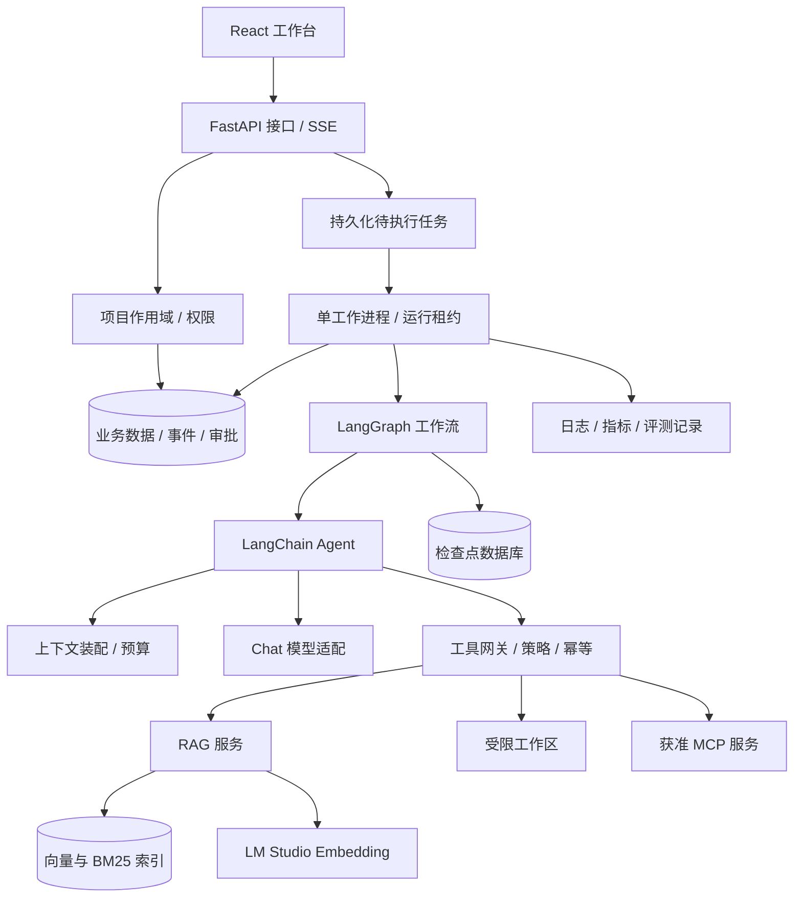

# 02 系统架构与技术选型

> 以下为目标架构和拟建目录，不是现有代码说明。

## 1. 技术基线

| 层 | 默认方案 | 原因与边界 |
| --- | --- | --- |
| 后端 | Python 3.11、FastAPI、Pydantic | 明确接口与数据校验；实施时验证依赖兼容性 |
| Agent | LangChain `create_agent` | 统一模型、工具、消息与中间件接口 |
| 编排 | LangGraph | 承载显式工作流、子图和恢复节点 |
| 前端 | React、TypeScript、Vite | 展示运行时间线、知识库与评测页面 |
| 本地存储 | SQLite：业务表和检查点分库 | 单机轻量；分别管理迁移，避免侵入框架内部表 |
| 向量检索 | Qdrant Local，独立持久化目录 | 单进程访问作为 P0 限制；后续切换服务模式 |
| 稀疏检索 | 中文分词 + BM25 可重建索引 | 版本化分词配置，避免默认英文分词影响中文效果 |
| 模型服务 | LM Studio Embedding；独立 Chat 适配器 | 向量化与生成职责分离 |
| 可观测性 | 本地结构化日志 + 运行事件表 | 云端追踪可选，默认不上传文档及消息 |
| 测试 | pytest、接口契约测试、浏览器关键流程测试 | 以行为、权限和故障边界为重点 |
| 依赖管理 | uv + Python 锁文件；前端锁文件 | 在 M0 选择并冻结实测版本，不写“latest”承诺 |

`create_agent` 可用作 Agent 节点，应用的确定性业务流使用显式图组织。避免在外层和内层同时维护互相冲突的模型/工具循环。参考 [Agents](https://docs.langchain.com/oss/python/langchain/agents)。

## 2. 组件关系



API 返回接受状态后，工作进程从业务数据库领取任务。P0 不用一次 HTTP 请求中的内存后台任务承担持久任务责任。文档索引和查询均由同一工作进程访问 Local 向量库，API 不另开一个竞争该目录的实例。

## 3. 模块职责

- `api`：鉴权、校验、任务提交、SSE、下载；不直接执行模型和工具循环。
- `runtime`：任务领取、租约、取消信号、图状态同步、故障恢复。
- `agents`：Agent 工厂、角色定义、图、结构化输出。
- `harness`：上下文装配、预算、策略、模型路由、工具包装、循环检测。
- `knowledge`：解析、chunk、索引、检索、引用、删除和重建。
- `tools`：本地工具、模拟工单、MCP 适配，统一走工具网关。
- `memory`：长期记忆与来源；不是知识库的同义词。
- `storage`：业务仓储和检查点接线，隐藏具体数据库接口。
- `observability`：事件、脱敏、统计，不储存或展示模型隐式思维链。
- `evals`：数据集、回归、对照实验和报告。

## 4. 建议目录

```text
langChain_try/
  README.md
  docs/
  backend/
    pyproject.toml
    uv.lock
    src/harnesslab/
      api/             # 路由、认证、SSE
      runtime/         # 工作进程、租约、取消、恢复
      agents/          # 图、角色、Agent 工厂
      harness/         # 上下文、权限、预算、中间件
      knowledge/       # 导入、索引、检索、引用
      tools/           # 本地工具和 MCP
      memory/          # 跨会话记忆
      storage/         # 业务仓储和检查点配置
      observability/   # 运行事件与指标
      evals/           # 评测执行
    tests/
  frontend/
    src/
      pages/
      components/
      api/
  configs/             # 无密钥的模型、策略和演示配置
  prompts/             # 版本化 Prompt
  skills/              # 项目自己的受控 Agent 技能
  datasets/demo/       # 自建合成资料，附许可说明
  datasets/eval/       # 固定训练外测试样本
  scripts/             # 接入探测、种子数据、诊断
  data/                # 本地运行数据，忽略提交
  artifacts/           # 生成产物，忽略提交
  .env.example         # 后续生成的配置模板
```

## 5. 存储与一致性

SQLite 业务表保存任务、事件、审批、工具操作、文档元数据和产物索引；检查点由框架的独立数据库管理。两者不存在自动跨库事务。

每个工具副作用先持久化操作意图和幂等键，再执行，再保存结果；图恢复时查询操作记录决定复用结果还是执行。外部系统必须支持幂等或结果查询；结果不确定时进入人工核对，不能直接重试。

每个图节点用 `run_id + node_execution_id` 对业务事件去重；恢复协调器核对 graph checkpoint 与业务 run 状态。业务表中的终态只能在图结果或确定失败证据提交后更新。

框架检查点负责图状态；业务事件流负责界面恢复；工具账本负责副作用去重。三者不能互相替代。框架持久化概念参见 [Persistence](https://docs.langchain.com/oss/python/langgraph/persistence)。

## 6. 扩容路线

单机阶段固定单工作进程，SQLite 短事务，索引任务和交互任务使用公平队列。服务模式迁移到 PostgreSQL、服务化 Qdrant 和独立工作进程；随后引入对象存储、外部队列及多用户认证。

迁移需要数据导出校验、索引重建、检查点版本兼容和恢复演练，不只替换连接字符串。旧图版本的待审批任务继续绑定旧版本工作进程，或显式迁移后再恢复。
