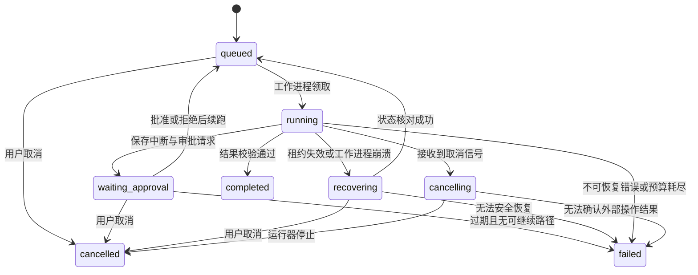

# 03 Agent Harness 详细设计

## 1. Harness 的职责

本项目把 Harness 定义为围绕模型决策的执行与控制层：为模型组装上下文，提供工具，管理任务状态，并约束权限、预算、失败和输出。以下策略是本项目设计，不应当被理解为 LangChain 自动提供的全部行为。

基础 Agent 使用 `create_agent`；预算、日志、工具策略等通过中间件和应用服务组合。框架中间件的接入点以冻结版本为准，参考 [Middleware](https://docs.langchain.com/oss/python/langchain/middleware/overview)。

## 2. 单次任务生命周期

`waiting_approval` 释放执行槽位，保留检查点；审批等待时间不计入活跃执行时长，但有独立过期时间。`completed / failed / cancelled` 是终态；重试终态任务创建新 run，并记录 `parent_run_id`。

同一 thread 默认只允许一个非终态 run，包括等待审批的 run。新问题可另建 thread，避免两个运行同时修改同一会话状态。

## 3. 逻辑执行流

1. 校验用户输入、项目范围、模型能力和运行配置；快照 Prompt、工具集、策略、索引版本。
2. 短任务直接进入 Agent；复杂任务先生成可编辑的步骤清单，限制计划规模。
3. 装配消息、任务进度、相关记忆、检索证据和可用工具 Schema。
4. 模型返回结构化答案或工具请求；工具请求统一进入网关。
5. 网关执行 Schema 校验、作用域检查、风险分类、预算预留和幂等查询。
6. 若需审批，保存 interrupt 与审批信息；批准后重新检查参数哈希和权限。
7. 执行工具，截断过大结果并保存完整产物，写入操作记录、用量与事件。
8. 判断完成、有限重试、重规划或终止；完成前校验输出和引用。

计划只描述目标、步骤和状态，不要求模型输出隐藏推理过程。工作台展示可验证的行动与简短依据。

## 4. 状态与上下文

| 状态字段 | 用途 | 约束 |
| --- | --- | --- |
| `messages` | 会话消息和工具结果 | 使用框架消息合并语义，保留工具请求与结果配对 |
| `task` / `plan` | 用户目标、步骤状态、完成条件 | 最多 12 步，重规划记录版本 |
| `evidence_refs` | 本次使用的 chunk 和来源版本 | 存引用，不把全部资料反复写入状态 |
| `artifact_refs` | 生成文件标识 | 仅保存授权工作区内的产物 ID |
| `budget` | 上限、消耗和预留 | 父子任务共享总预算，防止并发超卖 |
| `pending_actions` | 待审批调用的关联 ID | 审批权威记录在业务表 |
| `summary` | 历史压缩结果 | 标注生成版本、覆盖范围和可回看原始记录 |
| `schema_version` | 图状态结构版本 | 恢复时匹配运行器版本 |

`project_id`、用户身份、权限、密钥、工作目录根等来自服务端运行上下文；即使状态中保留其引用，也不允许模型更新这些权威值。模型凭证不进入检查点。

## 5. 上下文工程

装配顺序：系统规则 → 获准技能 → 用户目标与约束 → 当前计划 → 已确认长期记忆 → 检索证据 → 最近消息 → 工具结果摘要。

检索资料、网页和工具返回都作为不可信数据块，包含来源、时间和用途标签。来源中的命令不能改变权限或系统配置。

上下文预算以选定 Chat 模型实测窗口为基准：先扣除输出预留、工具 Schema 和系统内容，再分配给证据与历史。达到可用输入预算的 80% 时压缩较早历史；估算器不匹配本地 tokenizer 时留额外余量并记录估算标签。

压缩必须保留用户明确约束、审批状态、未完成步骤、产物 ID、引用 ID 和工具失败事实。不能留下孤立的 tool 消息。原始日志保留供审计，但不再全部发送给模型。压缩后的任务继续接受同样权限检查。

## 6. 模型路由与结果校验

模型档案记录：流式输出、工具调用、结构化输出、上下文窗口、并发上限和价格配置。只有通过实测的能力才能被启用。

P0 固定一个 Chat 模型；P1 可把简单摘要交给另一个模型，主决策模型保持稳定。切换时保留消息兼容性，记录每次调用的真实提供方和模型 ID。本地失败后默认报错，不自动将私有上下文发送到云端。

最终响应 Schema：`answer`、`citations[]`、`artifacts[]`、`limitations[]`、`task_status`。Schema 失败允许一次受控修复；再次失败返回明确错误和可用中间产物，不把原始文本冒充已验证结果。

## 7. 工具契约

每个工具声明 `name`、`version`、输入/输出 Schema、`effect`、权限、超时、输出上限、是否支持幂等、是否允许并发和审批策略。

| 工具 | 用途 | 默认策略 |
| --- | --- | --- |
| `search_knowledge` | 按授权索引检索 | 只读；项目范围由后端添加 |
| `read_source` | 查看命中文档的原始片段 | 只读；校验来源版本与访问权限 |
| `calculator` | 数值计算 | 受限表达式解释器，禁止 Python `eval` |
| `list_artifacts` / `read_artifact` | 读取当前项目产物 | 只读；按 ID 访问 |
| `write_report` | 新建报告 | 只能写当前 run 工作区，默认不覆盖 |
| `create_demo_ticket` | 创建本地模拟工单 | 需人工审批；持久化幂等键 |
| `query_reference_mcp` | 查询自建参考资料服务 | P1；静态注册，只读 |
| `run_python_sandbox` | 隔离计算 | P2；禁用网络、限资源、沙箱不可用则禁用 |

工具返回统一结构：`ok`、`data`、`error_code`、`retryable`、`artifact_ref`、`truncated`、`duration_ms`。过大响应保存为受控产物，模型只收到摘要及读取入口。

## 8. 人工审批与持久恢复

审批载荷包含工具名、规范化参数、参数哈希、目标资源、预期影响、有效期、`tool_call_id` 和 `checkpoint_id`。一次批准仅绑定该参数版本。

用户修改参数时创建新审批版本，再由用户确认；旧批准失效。拒绝作为工具拒绝结果返回图，允许 Agent 完成其他步骤。重复批准、越权批准和已取消任务的批准分别返回确定状态或冲突。

LangGraph interrupt 恢复依赖持久检查点和稳定 thread 标识；恢复可能重新进入中断所在节点。把非幂等操作放在批准后的独立边界，并用工具账本去重，不能假设从暂停代码的下一行直接执行。参见 [Interrupts](https://docs.langchain.com/oss/python/langgraph/interrupts)。

应用恢复顺序：取得新租约及 fencing token → 核对图版本与检查点 → 查询未完成操作 → 对账已知结果 → 将恢复事件持久化 → 继续执行。外部操作状态不明确时停止自动执行，进入 `waiting_approval` 的“人工核对”类别；不得把再次批准等同于安全重试。

## 9. 预算、重试和取消

初始默认值：模型调用最多 20 次、工具调用最多 30 次、活跃运行 180 秒、单工具 30 秒、同类失败最多重试 2 次、重规划最多 2 次、子任务总数最多 4、嵌套深度最多 1。这些是产品配置，不等同于框架的 recursion limit。

另设 input/output token 总预算；每次调用按最坏输出量预留，结束后结算。价格不可用时展示调用量和未知费用，不能显示成费用为零。并行子任务从父级原子预留预算。

只对明确可重试的读操作或具有幂等保证的写操作进行指数退避和抖动重试。认证错误、输入错误、权限错误不重试。相同工具和参数连续三次没有新结果则触发循环检测。

取消信号在模型调用前后、工具执行前后和重规划边界检查。尽可能取消客户端请求，但不假设远端已停止计费或执行。已经提交的副作用写入取消结果，不能声称已撤回；不能确定是否成功时进入人工核对流程。

## 10. 长期记忆

短期记忆由 thread 状态承载；长期记忆保存跨会话稳定偏好和用户确认事实；知识库保存原始资料。长期记忆包含来源、确认状态、作用域、置信信息、创建时间和过期时间。

默认由用户确认候选记忆后生效；敏感凭证禁止写入。检索时按项目与用户过滤。删除后清理实体与派生索引，并防止后台摘要重新写回已删除内容；以 tombstone 或记忆修订号解决竞态。

## 11. 多 Agent 与回放

研究者只有检索权限；核查者读取候选结论和证据；写作者读取核查结果并写报告。父级负责预算和审批，子级不继承所有工具。初期使用固定角色子图，禁止无限动态委派。

子任务返回结构化 `findings / evidence_refs / uncertainties / artifacts`，由父级做去重和冲突合并。子任务失败允许部分结果汇总，报告必须标注缺项。父任务取消时停止新子任务并向活跃子任务传播取消。

“回放”只读取已持久化事件和产物；“重跑”创建新 run；“从检查点分叉”创建新分支标识并重新审批副作用。三种操作在界面和 API 中明确区分。
